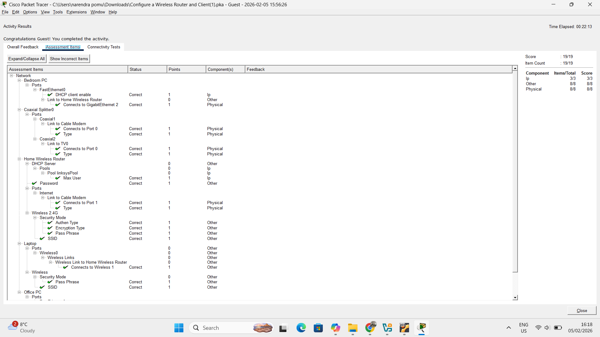
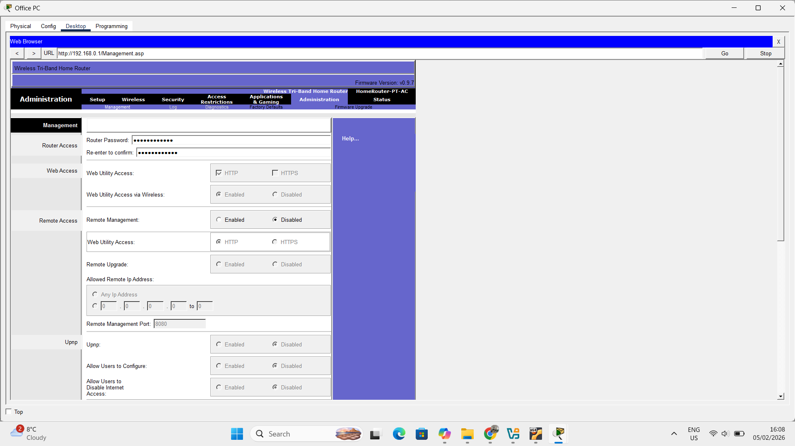
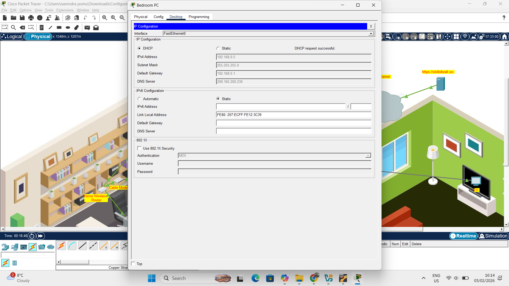

## Hands-On Networking Lab Completed (Cisco Packet Tracer)

## Overview
Completed a practical home-network configuration lab using Cisco Packet Tracer, focused on building and securing a real-world residential network.

## Objectives
-End-to-end ISP connectivity (coaxial → modem → wireless router)
-Wired and wireless client setup
-DHCP configuration and IP address management
-Router administration and security hardening
-Secure Wi-Fi deployment (SSID + WPA2 Personal)
-Connectivity testing across all devices

## Takeaways
Strengthened my understanding of core networking fundamentals like DHCP, default gateways, IP addressing, and wireless security through hands-on configuration and verification.

## Screeshots

